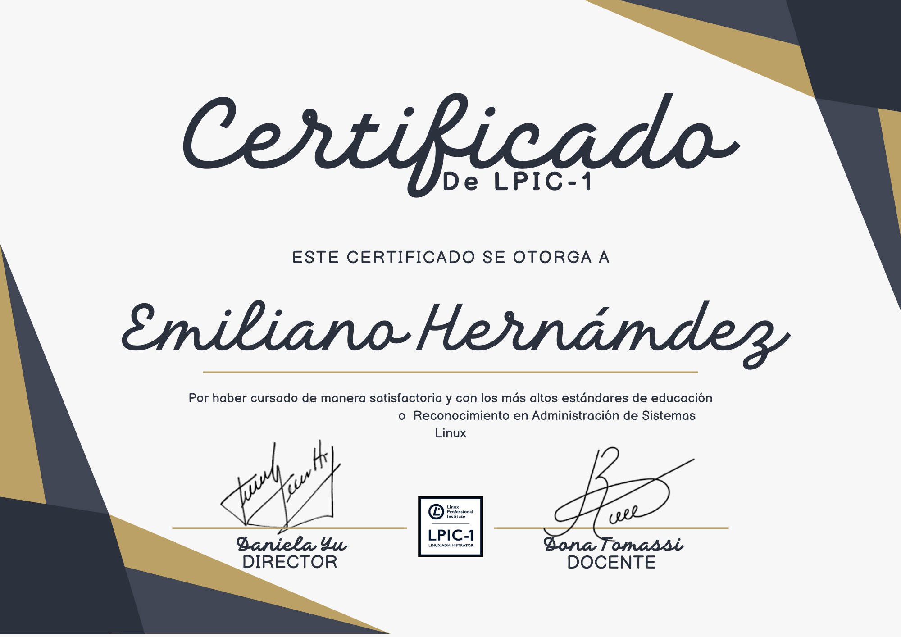

<h1>Redes</h1>

<h1>CompTIA Network+</h1>

     

<h1>Cisco CCNA (Cisco Certified Network Associate)</h1>

      

<h1>Juniper JNCIA-Junos</h1>

 
    

<h1>CompTIA Cloud+</h1>

      

<h1>Aruba Certified Network Associate (ACNA)</h1>

 
    

<h1>Sistemas Operativos</h1>

<h1>LPIC-1</h1>

     

<h1>Red Hat Certified System Administrator (RHCSA)</h1>

      

<h1>Microsoft Certified: Windows Server Fundamentals</h1>

 
    

<h1>MCSA: Windows Server 2016</h1>

      

<h1>Google Associate Cloud Engineer</h1>

 
    

   

